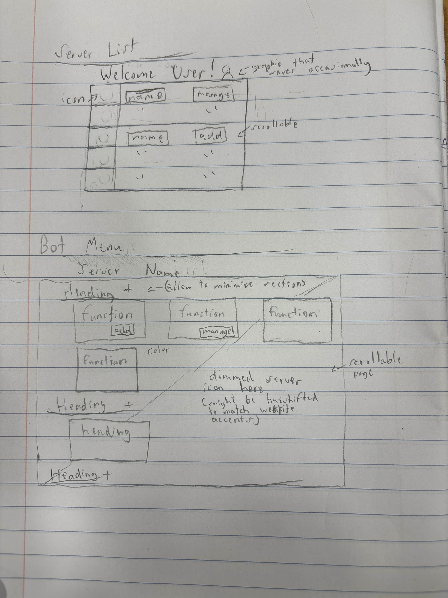
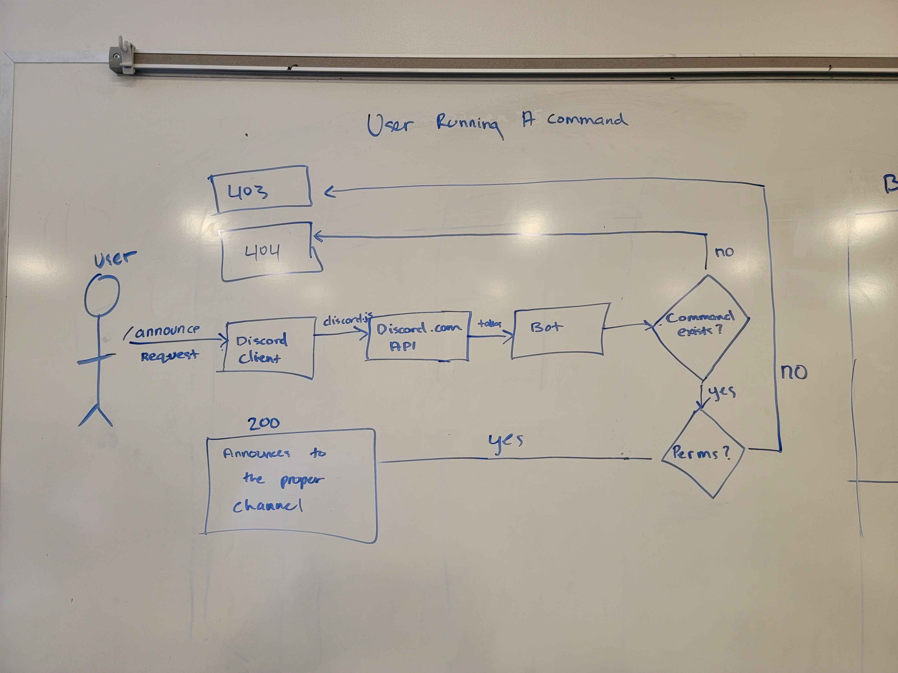

# Design Specification

---

### Requirement 1: Bot Feedback and Reporting

#### Requirement Text:

Server moderators should be able to report issues or provide feedback about the bot to help keep the server safe.

#### Design Statement:

- Implement a bot command (e.g., `/report`) for server moderators to report bugs or provide feedback.
- Store the feedback in database that developers can access for issue tracking.
- Integrate email or webhook notifications to alert developers when a report is submitted.

---

### Requirement 2: Authentication and Bot Invitation

#### Requirement Text:

Server moderators must authenticate using Discord and be able to choose which servers to invite the bot to.

#### Design Statement:

- Implement Discord OAuth2 login to allow server moderators to authenticate securely.
- Ensure that only authenticated users who have server management permissions can invite or manage the bot.
- After authentication, query the Discord API to retrieve a list of servers that the user manages.
- Display the servers as a grid on the admin website, showing the server name, icon, and management options.

---

### Requirement 3: Website Navigation and UI

#### Requirement Text:

Server moderators should be able to configure the bot through a user-friendly, responsive admin website with clear navigation.

#### Design Statement:

- Implement a left-hand sidebar on the admin website for navigation between different bot configuration sections (e.g., dashboard, settings, commands, feedback).
- The sidebar should be collapsible for smaller viewports and automatically adjust to screen sizes to maintain usability on mobile devices.
- Use modern CSS frameworks such as Tailwind CSS to ensure a responsive layout that adapts to different viewport sizes.
- Each section should have distinct visual elements and proper labeling to guide users in configuring the bot. Also, sidebar tabs must have proper icons for better UX.
- Ensure that navigation between different sections is fast, and no full-page reload is needed (use SPA).

---

### Requirement 4: Command Help Guide

#### Requirement Text:

Server moderators and end-users should have access to a help guide for all available bot commands, based on their permissions.

#### Design Statement:

- Implement a command (e.g., `/help`) in the bot that displays a categorized list of commands based on the user’s permissions in the Discord server.
- The help command output should show descriptions and usage examples for each command available to the user.
- On the admin website, provide a dedicated "Help Guide" tab that lists all bot commands.
- Each command in the table should have a description, required permissions, and examples of how to use it.

