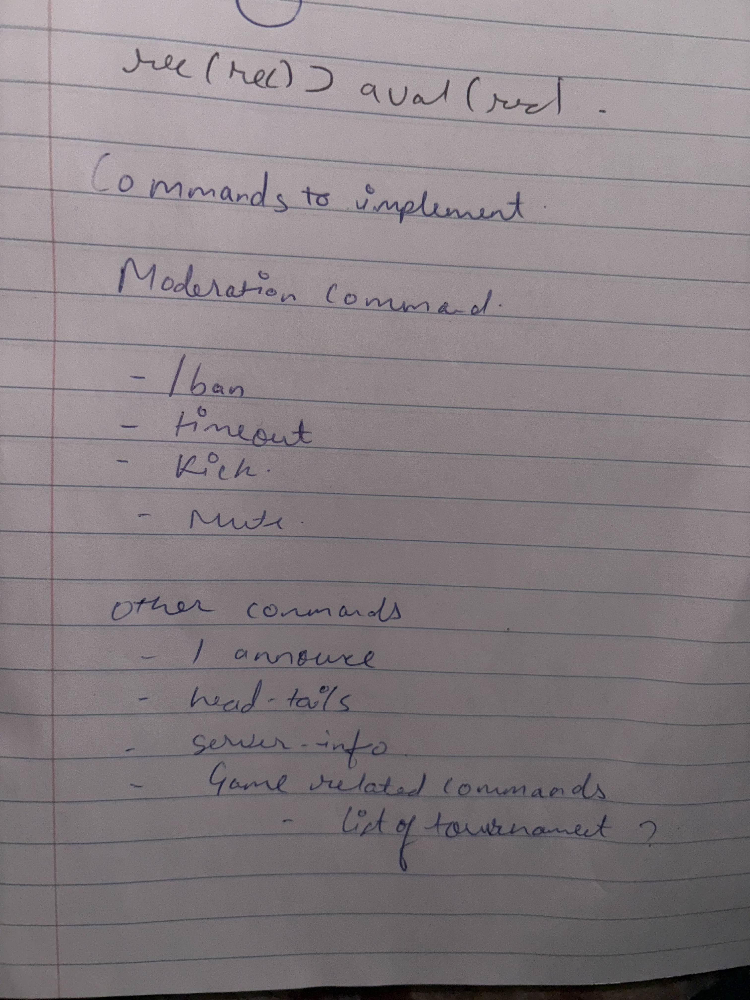

# Meeting Minutes (October 3rd, 2024)

## Administrivia

The scribe is the person taking the _notes_. This is encouraged to be a single person to reduce problems.

- Time: _12:20 - 13:20_
- Location: _eSports Facility_ (virtual?)
- Scribe: _Joshua Quaintance_

## Agenda

- MVS
  - Pick and choose which user stories to go through with
  - Figure out the technical requirements for each stories

## Notes

- Josh: _Start simple with the user story and figure out the technical parts of the MVS_
  - Ishan: _We need to put a technical description on how to complete the user-stories_
  - Jared: _Don't overcomplicate it_
- Josh: _Do each user stories with the person tasked on doing it leading on what the minimum spec is_
- Ishan: _Looking at the specs right now, we might not even need a database_

  - Josh: _Discord also handles a lot of data that would need to be stored anyways so we might scratch the database since we're storing almost nothing_
  - Gani: _I can switch to helping with the HTML and CSS instead or a little bit of the backend_

- Josh: We will probably start coding next week

Flowchart and swimlane that was made this week

## Action Items

These are generally distilled from the notes. Essentially, these are "by the next meetings, _this person_ will take _this action_."

- Joshua

  - Start finalizing the monorepo initialization
  - Lay foundation for backend API

- Jared

  - Finishing up on tailwind and Svelte
  - Starting the site template

- Ishan

  - Initialize basic discord.js bot on the monorepo with basic functionality
  - Start creating endpoints for the backend to touch

- Gani

  - Freshen up on some HTML and help Jared on starting the HTML templates

## Signatures

After the notes and action items have been pushed, each person should take a time to review them. If everything is agreeable, push a single commit with your name as a signature.

- Joshua Quaintance
- Ishan Ghimire
- Jared Subr
- Gani Sagiev

# Meeting Minutes (October 22nd, 2024)

## Agenda

- Figure out our Design Patterns

## Notes

- Team works on Adapter & Façade: Structural Patterns.

- Creating a diagram for our façade. Containing the user and discord.js client going into the client app as adapter. And the client app goes into the discord.js façade that can search for the commands and etc.

- Team discussed on what components are necessary to show the structural pattern for our discord bot.

- Joey checks on our diagram and approves of the structure.

For our structural pattern, we were showing both a facade and adapter pattern. For our adapter, we are using the provided `client` object from `discord.js` that do not have a way to store commands in it. So we created a new interface that extends `client` called `ClientApp` that has the commands variable attached to it. This is so that when we pass around the client (which we will be doing quite a lot), we do not need to pass another parameter only for the commands that the client has because it's already in the object.

For the facade, we are basically showing that we are abstracting the utilities that are provided by `discord.js` and the end user only has to interact with our bot client, but behind the scenes, there are a lot more things that the `client` that are doing, and even more behind, there are a lot of things that `discord.js` that is doing for us.

## Signatures

- Gani Sagiev
- Jared Subr
- Joshua Quaintance
- Ishan Ghimire

# Meeting Minutes (October 31st, 2024)

## Agenda

- Refining ideas and designs for the landing and bot management web pages

## Notes

- Team works together discussing the desired formatting for the webpages, using Mee6 bot as inspiration.

- Jared drew out a rough sketch of the webpages, annotating each part of the drawing to further explain how we will approach the designs.

- Ideas were bounced back and forth about what to include in the webpage. Mee6 is mentioned but we make sure to only borrow ideas in order to establish our design approach as our own ideas an not an act of plaigarism.

## Signatures

- Jared Subr
- Ishan Ghimire
- Joshua Quaintance

## Meeting Minutes (November 05 2024)

## Agenda

- Refine/create UI interface

## Notes

- Team does not currently have a UI implemented.
- Helped another group check out their UI and give feedback
- Written 3 reports on bad UI design from existing softwares/websites.

## Action Items

- Workday
  `Workday website has a job application page in which they request a PDF of your resume then ask you to fill in their fields on your experience, school, and etc. It defeats the whole point of submitting a Resume and on top of the the application on their website must be filled out for each job application. So if you apply for 5 jobs, you must fill out their fields for education and such 5 times. This is a horrible UI experience for users. This would make users end up using other job search websites.`

- Microsoft Teams
  `Microsoft Teams chat room is quoted as “communication software that simultaneously misses the mark on chat room experiences and discourages comminucation. It just doesn’t feel welcoming”. The sidebar navigation includes both Teams and Chat options which is confusing since both are used for chatting. In Teams there is no clear hierarchy between headers and the channelds they contain. There is simply too much information packed into the sidebars and the interface as a whole. Users also have limited control over customizing their workspace layout and a bigger issue no way of prioritizing the most frequently used sections. You cannot add tags or rename channels for your own benefit.`

- Outlook
  `The outlook email platform has an overload on features and buttons. The company tries to pack too much onto the screen at once that could overwhelm users. Especially those who are new to the platform. They mix in the email, calendar, task and contacts all into one platform. It makes navigating more complicated then need be. The navigation between the sections themselves is also not as smooth as it could be. And some actions are hidden away behind menus and icons that aren’t immediately clear. I myself had to google where certain buttons and features are. The design needs to be drastically simplified or the different sections need to be put into separate applications that can integrate.`

## Signatures

- Gani Sagiev
- Ishan Ghimire
- Joshua Quaintance
- Jared Subr

## Meeting Minutes (November 07, 2024)

### Agenda

- Plan and prioritize remaining features for the Discord bot.
- Decide whether to include custom features like custom commands and messages.

### Notes

**Josh**: "Custom commands are a good-to-have feature, but they add a lot of complexity. Discord.js doesn't support them directly, and we'd need to work around it."

**Jared**: "I think sticking to core features will help us finish on time. Let's avoid custom commands for now."

**Ishan**: "Agreed. Adding custom messages also doesn't align well with what we can realistically implement right now."

**Decision**: The team unanimously decided not to implement custom features like custom commands and messages, focusing instead on core bot functionalities.

**Jared**: "I set up a new SvelteKit repo locally and added some basic UI changes."

**Josh**: "We could replace the current repo with this new template, but we should keep dependencies like `package.json` intact."

**Ishan**: "I think replacing the repo might cause dependency issues. Let's avoid a complete replacement."

**Gani**: "How about we only replace the necessary files instead of the entire setup? That way, we keep things stable."

### Action Items

- Jared will refine the SvelteKit repo based on team feedback.
- Josh will ensure dependency files remain intact if the template changes are applied.

### Signatures

- Ishan Ghimire
- Joshua Quaintance
- Jared Subr
- Gani Sagiev
---

## Meeting Minutes (November 14, 2024)

### Agenda

- REST API initialization and server setup for sending requests.
- Discussion on challenges with custom command implementation.

### Notes

**Josh**: "We're going to need a server to handle requests between the bot and the systems it's interacting with. I've added Express.js to the project for this."

**Ishan**: "Implementing custom commands is proving to be difficult. Discord.js doesn't have built-in support for them, and creating them dynamically would be complicated."

**Jared**: "Yeah, and the front-end part would be tricky too. We'd need to let users configure the commands dynamically."

**Decision**: The team reiterated their decision to exclude custom commands and messages to keep the project focused and manageable.

### Action Items

- Josh will set up the REST API using Express.js.
- The team will continue developing the bot's core functionalities.

### Signatures

- Ishan Ghimire
- Joshua Quaintance
- Jared Subr
- Gani Sagiev
---

## Meeting Minutes (November 19, 2024)

### Agenda

- Discuss commands to implement based on requirements.
- Review Discord OAuth implementation.

### Notes

**Ishan**: "I'm working on basic commands like `server-info` and `about`. They should be straightforward to implement."

**Jared**: "We should also have a help command to list all the bot's available commands. It would be really useful for admins."

**Josh**: "Good idea. We can loop through the commands dynamically and display them when the help command is triggered."

**Gani**: "Let's add a fun command too, like a coin flip game. It could make the bot more engaging."

**Ishan**: "I like that idea. I'll work on the coin flip command and push the changes soon."

**Gani**: "How about adding eSports-related commands to get a list of tournaments? It would fit well with the Esports Club."

**Ishan**: "Yeah, we can implement it. We'll need a third-party API to provide data. Maybe something like PandaScore offers it? I'll look into it."

### Action Items

- Ishan to finalize and push basic commands.
- Jared to work on the help command functionality.
- Josh to support by ensuring dynamic command listing.
- Gani to assist with testing commands.
- Ishan to research third-party APIs like PandaScore for eSports tournament data.

### Signatures

- Ishan Ghimire
- Joshua Quaintance
- Jared Subr
- Gani Sagiev
---

## Meeting Minutes (November 23, 2024)

### Agenda

- Preview Discord OAuth implementation.
- Discuss moderation commands like `/ban` and `/kick`.

### Notes

**Josh**: "I finished the OAuth implementation. Here's a quick demo of how it redirects users back to the website after they authenticate."

**Gani**: "What's the difference between the client secret and the bot token? Are they interchangeable?"

**Josh**: "No, the client secret is specific to the OAuth application. It must be sent in the request body, while the bot token is for authentication between the bot and Discord."

**Jared**: "What about the redirect URI? How do we handle that?"

**Ishan**: "The redirect URI is where users are sent back after authenticating. It needs to be included in our environment configuration along with the client secret."

**Jared**: "What's the progress on moderation commands?"

**Ishan**: "I've been working on `/ban` and `/kick` commands. They should be ready by the end of the week."

### Action Items

- Josh to refine OAuth implementation.
- Ishan to complete and push moderation commands.
- Jared and Gani to test OAuth flow and work on FE accordingly.

### Signatures

- Ishan Ghimire
- Joshua Quaintance
- Jared Subr
- Gani Sagiev
