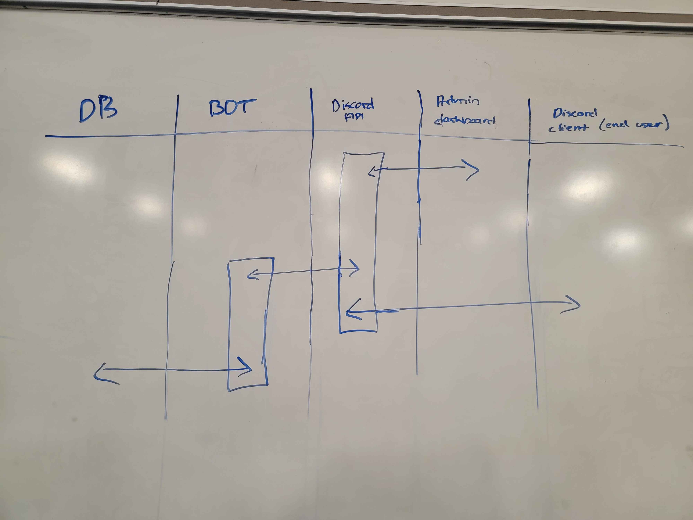

# Meeting Minutes (October 3rd, 2024)

## Administrivia

The scribe is the person taking the _notes_. This is encouraged to be a single person to reduce problems.

- Time: _12:20 - 13:20_
- Location: _eSports Facility_ (virtual?)
- Scribe: _Joshua Quaintance_

## Agenda

- MVS
  - Pick and choose which user stories to go through with
  - Figure out the technical requirements for each stories

## Notes

- Josh: _Start simple with the user story and figure out the technical parts of the MVS_
  - Ishan: _We need to put a technical description on how to complete the user-stories_
  - Jared: _Don't overcomplicate it_
- Josh: _Do each user stories with the person tasked on doing it leading on what the minimum spec is_
- Ishan: _Looking at the specs right now, we might not even need a database_

  - Josh: _Discord also handles a lot of data that would need to be stored anyways so we might scratch the database since we're storing almost nothing_
  - Gani: _I can switch to helping with the HTML and CSS instead or a little bit of the backend_

- Josh: We will probably start coding next week

Flowchart and swimlane that was made this week

## Action Items

These are generally distilled from the notes. Essentially, these are "by the next meetings, _this person_ will take _this action_."

- Joshua

  - Start finalizing the monorepo initialization
  - Lay foundation for backend API

- Jared

  - Finishing up on tailwind and Svelte
  - Starting the site template

- Ishan

  - Initialize basic discord.js bot on the monorepo with basic functionality
  - Start creating endpoints for the backend to touch

- Gani

  - Freshen up on some HTML and help Jared on starting the HTML templates

## Signatures

After the notes and action items have been pushed, each person should take a time to review them. If everything is agreeable, push a single commit with your name as a signature.

- Joshua Quaintance
- Ishan Ghimire
- Jared Subr
- Gani Sagiev
