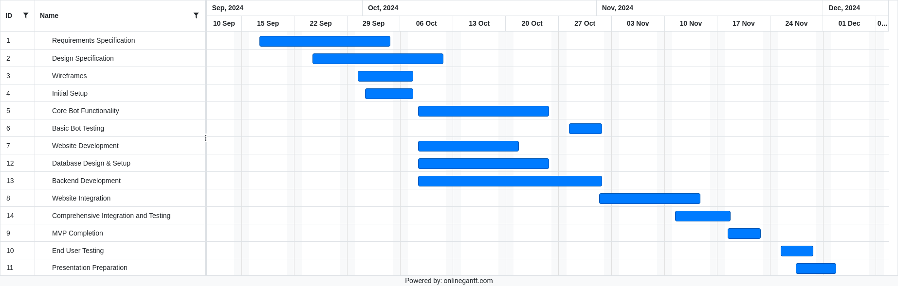

# Software Development Plan

## 1. Administrative
### Meeting Location(s)
- **Physical Location**: Esports Club, Student Union, Wright State University
    - After our CEG 4110 classtime, everybody in our group walks through the Student Union for varying purposes. Some of us are also members of the Esports Club. Having access to the clubroom, this made the most sense for us to have our weekly meetings there, migrating to other spaces in the Union or campus as needed in case of the club room being too busy or loud.  
- **Virtual Meetings**: Discord (For remote discussions and testing)
    - Outside of meeting in person, impromptu meetings through discord allow for us to easily share progress and ideas through its versatile interfaces and screen sharing features.

### Meeting Times
- **Weekly Progress Meeting**: Tuesdays and Thursdays, 12:30 PM - 01:30 PM
    - Many of our schedules have conflicts that would prevent us from meeting on most weekdays, but there is a gap in the middle of the day on Tuesday and Thursday that allows for us to host in-person meetings. While we are currently planning for one hour meetings, the size of the gap allows for additional meeting time if needed. 
- **Ad-hoc Meetings**: Scheduled through Discord as needed.
    - In the case of not getting to address every topic during our weekly progress meetings, discord allows for us to meet on short notice and finish discussing those topics.

### Communication Plan
- **Weekly Meetings**:
    - Review progress
    - Identify blockers
    - Assign tasks for the next week
    - Time: 1 hour

### Project Management
- **Tool**: GitHub for ticketing and task management
- **Task Assignment**: Tasks assigned based on expertise and workload.
    - Our group has a wide spread programming backgrounds and experiences as well as varying course-loads so tasks will be assigned accordingly.
- **Documentation**: Maintained on Google Docs.
    - Google Docs is easy for everyone to access and make edits from without creating conflicts.

---

## 2. SDLC Details
- **Requirements**: At the start of each sprint, we will discuss what requirements we will need to focus on in order to meet our milestone. Any ideas for requirements that are not listed will be considered and added as necessary, with approval from the team.
- **Design**: Once the requirements are set, we will look at the design specifications to understand how we will need to approach development in meeting the requirements. 
- **Development**: As development work is done on the components, daily meetings will be held to discuss how progress is moving along as well as any challenges that we are having. Goals for the next day will be discussed and set to ensure the pace we are going at will allow us to meet the sprint's deadline. 
- **Testing**: As components are created, we will perform various testing methodologies to ensure that they meet the listed requirements and design specifications.
- **Deployment**: Once testing is complete and prominent bugs are patched, branches will be merged and pushed to the main branch.
- **Review**: As the sprint comes to a close, we will reflect on everything that happened during the sprint to discuss what went well and what went wrong.
---

## 3. Timeline

### Minimum Viable Solutions (MVSs)
- **MVS 1**: Basic command handling and event listener setup.
- **MVS 2**: User registration with Discord OAuth.
- **MVS 3**: Auto-moderation tools (mute, kick, ban).
- **MVS 4**: Bot control from the website (with basic command customization and moderation controls).

## Milestones(Check-ins)

### Milestone 1: Core Bot Functionality Implemented
- **Date**: End of Week 9 (10/25/24)
- **Description**: Implement core bot functionalities including basic command handling and event handling.

### Milestone 2: Website Integration and Basic Features
- **Date**: End of Week 10 (11/01/24)
- **Description**: Develop and integrate the Svelte-based admin dashboard with basic bot management features.

### Milestone 3: Comprehensive Integration and Testing
- **Date**: End of Week 11 (11/08/24)
- **Description**: Integrate all components and conduct thorough testing to ensure functionality and stability.

### Milestone 4: MVP Completion
- **Date**: End of Week 12 (11/15/24)
- **Description**: Finalize the Minimum Viable Product with all core features fully implemented and refined.

### Milestone 5: Final Review
- **Date**: Week 14 (12/02/24)
- **Description**: Perform a project review, finalize documentation, and prepare for the final presentation.

### Requirement Specification

- **Date**: End of Week 6 (10/04/24)

### Design Specification

- **Date**: End of Week 7 (10/11/24)

### Gantt Chart

